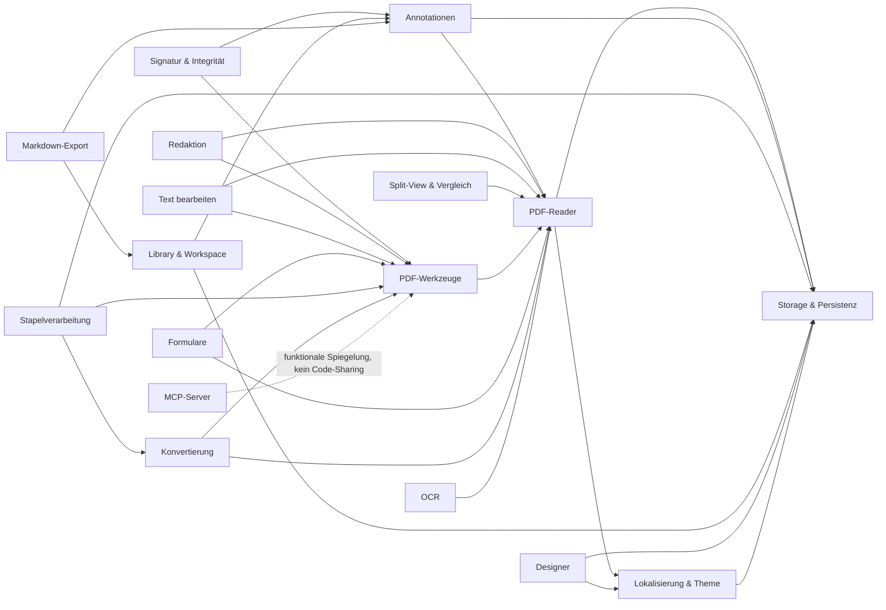

# Codebase-Blueprint

**Repository:** Pagebound (PDF-Tool)
**Generiert:** 2026-07-03
**Scope:** Komplettes Repo

## Überblick

Pagebound ist ein datenschutzfreundlicher, quelloffener Adobe-Reader-Ersatz als Blazor-WASM-PWA: PDF lesen, annotieren, signieren, manipulieren, konvertieren und gestalten — vollständig lokal im Browser, ohne Backend, ohne Telemetrie, ohne externe Requests. Der Stack: C#/.NET 10 (Core-Domain + Infrastructure-Services) über JS-Interop-Bridges (TypeScript, esbuild) auf pdf-lib, PDF.js und Tesseract.js; Persistenz via IndexedDB und Sidecar-JSON-Dateien. Zusätzlich liefert ein separater Node.js-MCP-Server dieselben PDF-Fähigkeiten für LLM-Agents.

## Features

| Feature | Kurzbeschreibung | Blueprint |
|---------|------------------|-----------|
| PDF-Reader & Viewer | PDF.js-Rendering mit Zoom, Volltextsuche, Outline, Thumbnails, Nachtmodus, fortlaufender Ansicht | [pdf-reader.md](./pdf-reader.md) |
| Annotationen | Highlights, Sticky Notes (Markdown), Ink/Formen, Freitext-Werkzeug + Datum-Stempel; IndexedDB + Sidecar | [annotationen.md](./annotationen.md) |
| Signatur & Integrität | PNG-Unterschrift mit Signer-Metadaten und SHA-256-Integritäts-Hash samt Status-Badge | [signatur-integritaet.md](./signatur-integritaet.md) |
| Schwärzung (Redaktion) | Destruktive Schwärzung per Seiten-Rasterung, transient, optionaler Audit-Report | [redaktion.md](./redaktion.md) |
| Text bearbeiten | Inline-Textbearbeitung im Reader (Cover + Redraw), transient, Export als `.edited.pdf` | [text-bearbeiten.md](./text-bearbeiten.md) |
| Split-View & Vergleich | Zwei PDFs nebeneinander plus Text-Diff mit strukturierter Ergebnisansicht | [split-view-vergleich.md](./split-view-vergleich.md) |
| PDF-Werkzeuge | Merge, Split, Reorder, Rotate, Compress, AES-256-Encrypt, Stamp, Metadaten — alles via pdf-lib im Browser | [pdf-werkzeuge.md](./pdf-werkzeuge.md) |
| Formulare (AcroForms) | Felder lesen/füllen/flatten plus Form-Builder zum Platzieren neuer Felder | [formulare.md](./formulare.md) |
| Stapelverarbeitung | Regeln (Compress/Encrypt/Export) auf mehrere PDFs, ZIP-Ergebnis, Regeln in IndexedDB | [batch.md](./batch.md) |
| Konvertierung & Standards | PDF→PNG/JPG/Text/HTML/CSV/DOCX, Bilder→PDF, Best-Effort PDF/A-2b und PDF/UA-1 | [konvertierung.md](./konvertierung.md) |
| OCR | Self-hosted Tesseract.js (eng+deu, Web Worker, kein CDN) mit selektierbarem OCR-Text-Layer | [ocr.md](./ocr.md) |
| Library & Workspace | PDF-Bibliothek mit Hash-Identität, Tags, Suche, Sidecar-JSON, optionaler Workspace-Ordner (FSA-API) | [library-workspace.md](./library-workspace.md) |
| Markdown-Export | Highlights + Notizen als Obsidian-kompatibles Markdown mit YAML-Frontmatter und Wikilinks | [markdown-export.md](./markdown-export.md) |
| WYSIWYG-Designer | Block-Editor für Flyer/Briefe/Rechnungen/Slides: Templates, Themes, CSV-Serien, QR, D3-Mindmaps, Print-CSS-Export | [designer.md](./designer.md) |
| Storage & Persistenz | IndexedDB (DB `pagebound`, Store `kv`), localStorage, File-System-Access-Handles — Basis-Schicht für alles | [storage-persistenz.md](./storage-persistenz.md) |
| Lokalisierung & Theme | DE/EN-JSON-Bundles mit `L.T()`, hell/dunkel + Akzentfarben via CSS-Variablen, Pre-Boot gegen FOUC | [lokalisierung-theme.md](./lokalisierung-theme.md) |
| MCP-Server | Separates Node.js-Paket (`mcp/`) mit 25 PDF-/Designer-Tools für LLM-Agents (stdio + Streamable HTTP) | [mcp-server.md](./mcp-server.md) |

## Abhängigkeitsgraph

Pfeil = „benutzt". Der MCP-Server teilt keinen Code mit der Web-App — er spiegelt die Funktionen mit denselben npm-Engines (pdf-lib, pdfjs-dist) in Node.js.

## Externe Kern-Dependencies

- `pdf-lib` — PDF-Manipulation (Werkzeuge, Flatten, Signatur-Embed, Formulare, MCP)
- `pdfjs-dist` — PDF-Rendering und Textextraktion (Reader, Konvertierung, MCP)
- `tesseract.js` — OCR, vollständig self-hosted (kein CDN)
- `Markdig` (NuGet) — Markdown-Rendering für Notizen (XSS-sicher, HTML deaktiviert)
- `esbuild` + `tailwindcss` v4 + `typescript` — Frontend-Build-Pipeline

## Wie diese Doku gepflegt wird

Diese Blueprints werden über den `codebase-mapper`-Skill erzeugt.

- Bei Änderungen am Code: Skill erneut aufrufen („aktualisiere den Blueprint"). Er erkennt `INDEX.md` und schlägt einen inkrementellen Re-Run vor.
- Manuelle Ergänzungen in `<feature-slug>.md` bleiben im inkrementellen Modus erhalten, solange der Skill die Datei nicht als veraltet einstuft.

## Verwandte Doku

- [README.md](../../README.md) — Feature-Überblick und Quickstart
- [docs/04-deployment-guide.md](../04-deployment-guide.md) — Docker, CI/CD, TLS
- [docs/05-benutzerhandbuch.md](../05-benutzerhandbuch.md) — Benutzerhandbuch (DE)
- [mcp/README.md](../../mcp/README.md) — MCP-Server-Referenz
