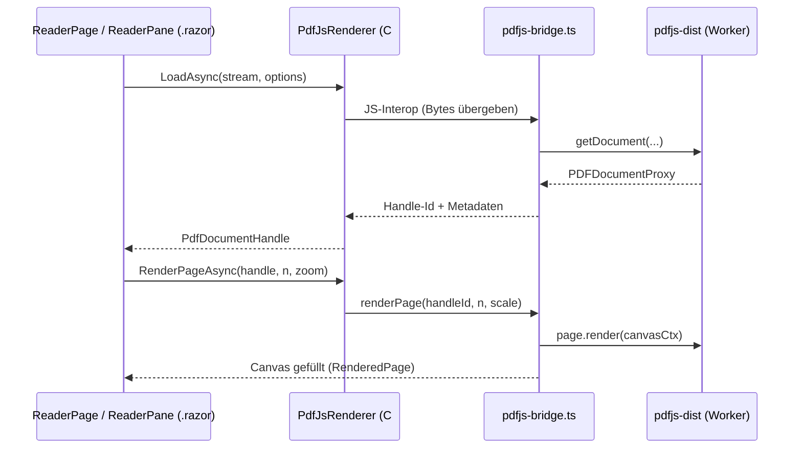

# PDF-Reader & Viewer

## Zweck

Kern-Anzeigefunktion von Pagebound: PDFs vollständig im Browser rendern (PDF.js via JS-Interop), ohne Server-Roundtrip. Umfasst Zoom, Volltextsuche, Dokument-Outline (Lesezeichen), Seiten-Thumbnails, Nachtmodus und fortlaufende (kontinuierliche) Seitenansicht. Der Renderer ist hinter `IPdfRenderer` abstrahiert, sodass die PDF.js-Implementierung später (z. B. für eine MAUI-Variante) durch eine native Implementierung ersetzt werden kann. Erfüllt laut Interface-Doku FA-001, FA-003 bis FA-008.

## Dateien

| Pfad | Rolle |
|------|-------|
| `src/Pagebound.Core/Abstractions/IPdfRenderer.cs` | Renderer-Abstraktion: Laden, Seiten-Rendering, Text-Extraktion, Suche, Outline |
| `src/Pagebound.Core/Domain/PdfDocumentTypes.cs` | Domain-Typen des Readers (u. a. `PdfDocumentHandle`, `RenderedPage`, `TextItem`, `SearchHit`, `PdfOutline`, Load-/Render-/Search-Options) |
| `src/Pagebound.Infrastructure/Pdf/PdfJsRenderer.cs` | Default-Implementierung von `IPdfRenderer`, kapselt PDF.js über JS-Interop |
| `src/Pagebound.Web/wwwroot/js/pdfjs-bridge.ts` | TypeScript-Brücke zu `pdfjs-dist` (Worker, Canvas-Rendering, TextLayer, Suche, Outline) |
| `src/Pagebound.Web/Features/Reader/ReaderPage.razor` | Reader-Seite: Datei öffnen, Toolbar, Seitenzustand, Sidebar (Outline/Thumbnails) |
| `src/Pagebound.Web/Features/Reader/ReaderPane.razor` | Wiederverwendbare Anzeige-Komponente: Seiten-Canvas, Zoom, fortlaufendes Scrollen, Annotation-Overlays |
| `src/Pagebound.Web/Features/Reader/OutlineNode.razor` | Rekursive Darstellung eines Outline-/Lesezeichen-Knotens |

## Abhängigkeiten

### Intern (andere Features dieses Repos)
- **Storage & Persistenz** — genutzt zum Ablegen/Wiederöffnen von Dokumenten und Zuständen (IndexedDB, File-Handles). Siehe [`./storage-persistenz.md`](./storage-persistenz.md).
- **Annotationen** — der Reader rendert die Annotation-Overlays in `ReaderPane.razor`. Siehe [`./annotationen.md`](./annotationen.md).
- **Lokalisierung & Theme** — Nachtmodus/Theming und deutsche UI-Texte. Siehe [`./lokalisierung-theme.md`](./lokalisierung-theme.md).

### Extern (Packages)
- `pdfjs-dist` (PDF.js) — Rendering, Textlayer, Suche, Outline im Browser

## Öffentliche API / Interface

```csharp
public interface IPdfRenderer
{
    Task<PdfDocumentHandle> LoadAsync(Stream pdf, LoadOptions options, CancellationToken cancellationToken);
    Task<RenderedPage> RenderPageAsync(PdfDocumentHandle handle, int pageNumber, RenderOptions options, CancellationToken cancellationToken);
    Task<IReadOnlyList<TextItem>> ExtractTextAsync(PdfDocumentHandle handle, int pageNumber, CancellationToken cancellationToken);
    Task<IReadOnlyList<SearchHit>> SearchAsync(PdfDocumentHandle handle, string query, SearchOptions options, CancellationToken cancellationToken);
    Task<PdfOutline?> GetOutlineAsync(PdfDocumentHandle handle, CancellationToken cancellationToken);
    Task UnloadAsync(PdfDocumentHandle handle);
}
```

## Datenfluss / Call-Flow



- Suche: `ReaderPage` → `SearchAsync` → Bridge iteriert TextLayer-Inhalte → `SearchHit`-Liste (Seite + Position) → UI springt zur Trefferseite und hebt hervor.
- Outline/Thumbnails: nach `LoadAsync` lädt die Sidebar `GetOutlineAsync` (rekursiv via `OutlineNode.razor`) bzw. rendert verkleinerte Seiten als Thumbnails.
- Nachtmodus: Darstellungsfilter auf der Render-Ausgabe, Theme-gesteuert.
- Fortlaufende Ansicht: `ReaderPane` rendert Seiten sequenziell in einem Scroll-Container und lädt sichtbare Seiten bei Bedarf nach.

## Offene Fragen / TODOs

- Genaue Strategie für Lazy-Rendering/Virtualisierung sehr großer Dokumente ist im Code zu verifizieren (nicht Teil dieses Blueprints).
