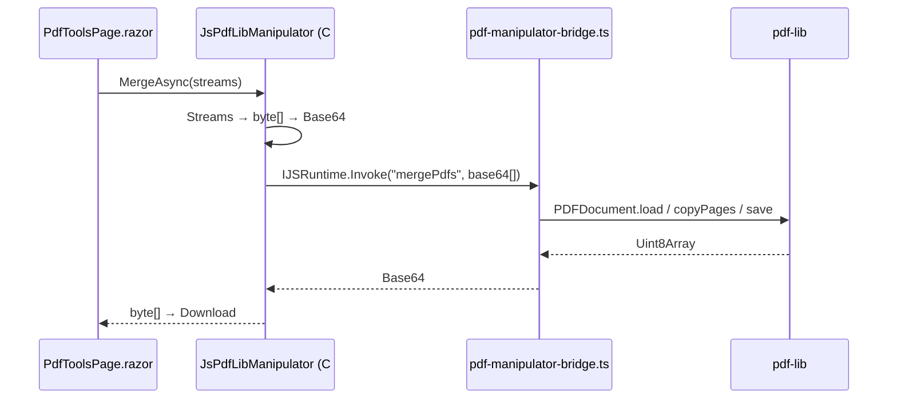

# PDF-Werkzeuge (Manipulation)

## Zweck

Alle PDF-Manipulationen ohne erneutes Rendering: Merge, Split, Reorder, Seiten löschen, Rotieren, Komprimieren, Verschlüsseln (AES-256), Stempel/Wasserzeichen/Seitenzahlen (Bates) sowie Lesen/Setzen von Dokument-Metadaten. Alles läuft zu 100 % im Browser (Blazor WASM), kein Server. Die UI bündelt die Werkzeuge auf einer Seite mit Kategorie-Tabs.

## Dateien

| Pfad | Rolle |
|------|-------|
| `src/Pagebound.Core/Abstractions/IPdfManipulator.cs` | Zentrales Interface: Merge/Split/Reorder/Delete/Rotate/Compress/Encrypt, `StampAsync`, `EmbedSignaturesAsync`, `FlattenAnnotationsAsync`, `RedactAsync`, `CreateFormFieldsAsync`, `Get/SetMetadataAsync`; plus Records `RedactionRegion`, `FormFieldRegion`, `PdfMetadata`, `EmbeddedSignature` |
| `src/Pagebound.Core/Abstractions/IPdfEncryptor.cs` | Interface für Passwort-Verschlüsselung (FA-027), Web-Implementierung rein managed (AES-256, kein MD5) |
| `src/Pagebound.Core/Domain/PdfManipulatorTypes.cs` | Options-Typen (u. a. `CompressionOptions`, `EncryptionOptions`) |
| `src/Pagebound.Core/Domain/StampTypes.cs` | `StampOptions` für Wasserzeichen/Seitenzahlen |
| `src/Pagebound.Infrastructure/Pdf/JsPdfLibManipulator.cs` | `IPdfManipulator`-Implementierung für WASM — vollständig über die pdf-lib-JS-Bridge; Verschlüsselung delegiert an `IPdfEncryptor` |
| `src/Pagebound.Infrastructure/Pdf/JsPdfEncryptor.cs` | Encryptor-Implementierung im Web-Pfad |
| `src/Pagebound.Web/wwwroot/js/pdf-manipulator-bridge.ts` | JS-Bridge (`pageboundPdfManipulator.*`): ruft pdf-lib-Funktionen wie `mergePdfs`, `copyPages`, `setRotation`, Draw-API auf |
| `src/Pagebound.Web/Features/PdfTools/PdfToolsPage.razor` | UI-Seite mit Kategorie-Tabs, die alle Werkzeuge gruppiert |
| `src/Pagebound.Web/Features/PdfTools/PdfToolsPanel.razor` | Werkzeug-Panel-Komponente |

## Abhängigkeiten

### Intern (andere Features dieses Repos)
- **PDF-Reader** — genutzt für die PDF.js-Rasterung im Compress-Pfad (Seiten werden neu gerastert). Siehe [`./pdf-reader.md`](./pdf-reader.md).
- **Signatur & Integrität** — `EmbedSignaturesAsync` bettet Signatur-PNGs samt Signer-Metadaten ins PDF ein (FA-015). Siehe [`./signatur-integritaet.md`](./signatur-integritaet.md).
- **Annotationen** — `FlattenAnnotationsAsync` brennt Sidecar-Annotationen dauerhaft in die PDF-Bytes. Siehe [`./annotationen.md`](./annotationen.md).
- **Redaktion** — `RedactAsync` ist die technische Basis für echtes Schwärzen (Rasterung + Inhalts-Entfernung). Siehe [`./redaktion.md`](./redaktion.md).
- **Formulare** — `CreateFormFieldsAsync` legt AcroForm-Felder für den Form-Builder an. Siehe [`./formulare.md`](./formulare.md).

### Extern (Packages)
- **pdf-lib** (JS, self-hosted) — sämtliche Seiten-Operationen, Draw-API, Form-Feld-Erzeugung.
- **PDF.js** — Rasterung im Compress- und Redact-Pfad (über den Reader).

## Öffentliche API / Interface

`IPdfManipulator` (Auszug, alle Methoden nehmen `CancellationToken`):

```csharp
Task<byte[]> MergeAsync(IReadOnlyList<Stream> pdfs, ...);
Task<IReadOnlyList<byte[]>> SplitAsync(Stream pdf, IReadOnlyList<int> splitAfterPages, ...);
Task<byte[]> ReorderAsync(Stream pdf, IReadOnlyList<int> newOrder, ...);
Task<byte[]> DeletePagesAsync(Stream pdf, IReadOnlyList<int> pageIndices, ...);
Task<byte[]> RotateAsync(Stream pdf, IReadOnlyDictionary<int, int> rotationDegrees, ...);
Task<byte[]> CompressAsync(Stream pdf, CompressionOptions options, IProgress<int>? progress, ...);
Task<byte[]> EncryptAsync(Stream pdf, EncryptionOptions options, ...);
Task<byte[]> StampAsync(Stream pdf, StampOptions options, ...);
Task<byte[]> SetMetadataAsync(Stream pdf, PdfMetadata metadata, ...);
Task<PdfMetadata> GetMetadataAsync(Stream pdf, ...);
```

`IPdfEncryptor.EncryptAsync(Stream pdf, EncryptionOptions options, CancellationToken)` — Owner-Passwort Pflicht, User-Passwort optional; Stärke im Web-Pfad fix **AES-256 nach ISO 32000-2 (`/V 5 /R 6`)**, Schlüsselableitung rein managed über SHA-256/384/512 (WebCrypto-kompatibel, kein MD5).

**Architektur-Entscheidung gegen PdfSharpCore** (dokumentiert im Kopf-Kommentar von `JsPdfLibManipulator.cs`): PdfSharpCores Save-Pfad ruft — auch bei plainem Save — im Konstruktor des `PdfStandardSecurityHandler` `MD5.Create()` auf, was unter Blazor WASM mit `TargetInvocationException` crasht (CryptoConfig-Reflection kennt MD5 nicht). pdf-lib hat diese Abhängigkeit nicht (Browser-Smoke-Test, 2026-05). Aus demselben Grund sind RC4 und AES-128 (`/V < 5`) im Web-Pfad bewusst nicht enthalten.

## Datenfluss / Call-Flow



Sonderfälle: `CompressAsync` rastert Seiten via PDF.js und baut das PDF neu; `EncryptAsync` delegiert an den managed `IPdfEncryptor` (kein JS nötig).

## Offene Fragen / TODOs

- Der Interface-Kommentar in `IPdfManipulator.cs` erwähnt noch eine Delegation der Seiten-Operationen an `PdfSharpManipulator` — laut `JsPdfLibManipulator.cs` läuft inzwischen alles über pdf-lib; der XML-Doc-Kommentar ist vermutlich veraltet.
