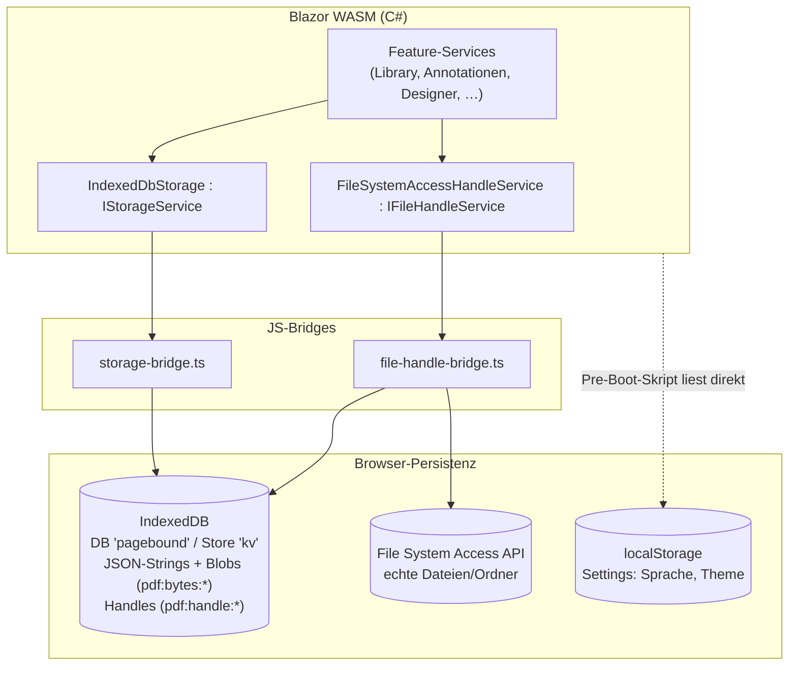

# Storage & Persistenz

## Zweck

Zentrale Persistenz-Schicht der PWA — alles bleibt lokal im Browser, kein Server (NFA-010, NFA-011). Drei Mechanismen:

1. **IndexedDB** (DB `pagebound`, ObjectStore `kv`): Schlüssel-Wert-Speicher. Werte werden als JSON-Strings abgelegt; für PDF-Bytes gibt es eine native Blob-Variante ohne JSON-/Base64-Roundtrip unter `pdf:bytes:{hash}`.
2. **localStorage**: leichtgewichtige Settings (Sprache, Theme), die schon vor dem Blazor-Boot lesbar sein müssen.
3. **File System Access API**: persistierte `FileSystemFileHandle`s unter `pdf:handle:{hash}` (One-Click-Reopen) sowie Directory-Handles für Workspace- und Design-Ordner — ebenfalls in IndexedDB abgelegt, da Handles strukturiert klonbar sind.

## Dateien

| Pfad | Rolle |
|------|-------|
| `src/Pagebound.Core/Abstractions/IStorageService.cs` | KV-Interface inkl. `SetBytesAsync`/`GetBytesAsync` |
| `src/Pagebound.Core/Abstractions/IFileHandleService.cs` | Interface für persistente File-Handles (`PickedPdf`) |
| `src/Pagebound.Infrastructure/Storage/IndexedDbStorage.cs` | `IStorageService`-Implementierung via JS-Interop |
| `src/Pagebound.Infrastructure/Storage/FileSystemAccessHandleService.cs` | `IFileHandleService`-Implementierung (Chromium, mit Neutral-Fallback) |
| `src/Pagebound.Web/wwwroot/js/storage-bridge.ts` | JS-Bridge: IndexedDB-Zugriff (DB `pagebound`, Store `kv`) |
| `src/Pagebound.Web/wwwroot/js/file-handle-bridge.ts` | JS-Bridge: File-Picker, Handle-Persistenz, Permission-Handling |

## Abhängigkeiten

### Intern (andere Features dieses Repos)

- **Library & Workspace** — größter Konsument: Library-Einträge, Bytes-Cache, File-/Directory-Handles. Siehe [`./library-workspace.md`](./library-workspace.md).
- **Annotationen** — persistiert Annotationsdaten pro PDF-Hash. Siehe [`./annotationen.md`](./annotationen.md).
- **WYSIWYG-Designer** — Autosave-Entwürfe und Design-Ordner-Handles. Siehe [`./designer.md`](./designer.md).
- **Lokalisierung, Theme & UI-Shell** — Sprache/Theme in localStorage (Pre-Boot-lesbar). Siehe [`./lokalisierung-theme.md`](./lokalisierung-theme.md).
- **Batch** — `IBatchRuleStore` legt Regeln über den KV-Store ab. Siehe [`./batch.md`](./batch.md).

### Extern (Packages)

- Keine — native Browser-APIs (IndexedDB, localStorage, File System Access) via JS-Interop.

## Öffentliche API / Interface

```csharp
public interface IStorageService
{
    Task<T?> GetAsync<T>(string key, CancellationToken ct);
    Task SetAsync<T>(string key, T value, CancellationToken ct);
    Task DeleteAsync(string key, CancellationToken ct);
    Task<bool> ExistsAsync(string key, CancellationToken ct);
    IAsyncEnumerable<string> KeysAsync(string prefix, CancellationToken ct = default);

    // PDF-Bytes nativ (kein JSON-/Base64-Overhead) — Keys: pdf:bytes:{hash}
    Task SetBytesAsync(string key, byte[] bytes, CancellationToken ct);
    Task<byte[]?> GetBytesAsync(string key, CancellationToken ct);
}

public interface IFileHandleService
{
    Task<bool> IsSupportedAsync(CancellationToken ct);            // showOpenFilePicker?
    Task<PickedPdf?> PickPdfAsync(CancellationToken ct);          // Bytes + Filename + TempHandleId
    Task<bool> PersistHandleAsync(string tempId, string hash, CancellationToken ct); // → pdf:handle:{hash}
    Task<PickedPdf?> TryReopenAsync(string hash, CancellationToken ct);
    Task ClearHandleAsync(string hash, CancellationToken ct);
}

public sealed record PickedPdf(byte[] Bytes, string Filename, string? TempHandleId);
```

## Datenfluss / Call-Flow



1. C#-Services rufen `IStorageService` auf → JS-Interop → `storage-bridge.ts` → IndexedDB (`pagebound`/`kv`). Objekte gehen als JSON-String rein/raus; `SetBytesAsync` legt `byte[]` nativ als Blob ab.
2. `IFileHandleService` erzeugt Handles per Picker (`file-handle-bridge.ts`), persistiert sie unter `pdf:handle:{hash}` in IndexedDB und reaktiviert sie später mit schmalem Permission-Dialog; ohne API-Support liefern alle Methoden neutrale Ergebnisse (Fallback beim Aufrufer).
3. Settings, die vor dem Blazor-Boot gebraucht werden (Theme/Sprache gegen FOUC), liegen in localStorage und werden vom Pre-Boot-Skript in `index.html` gelesen.
